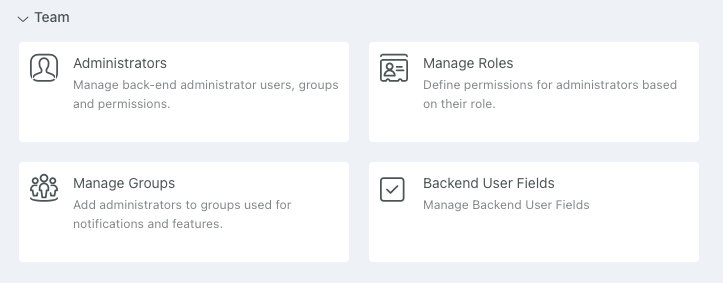
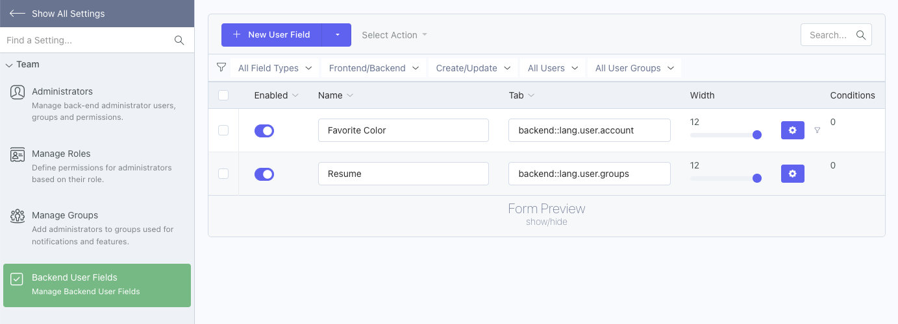
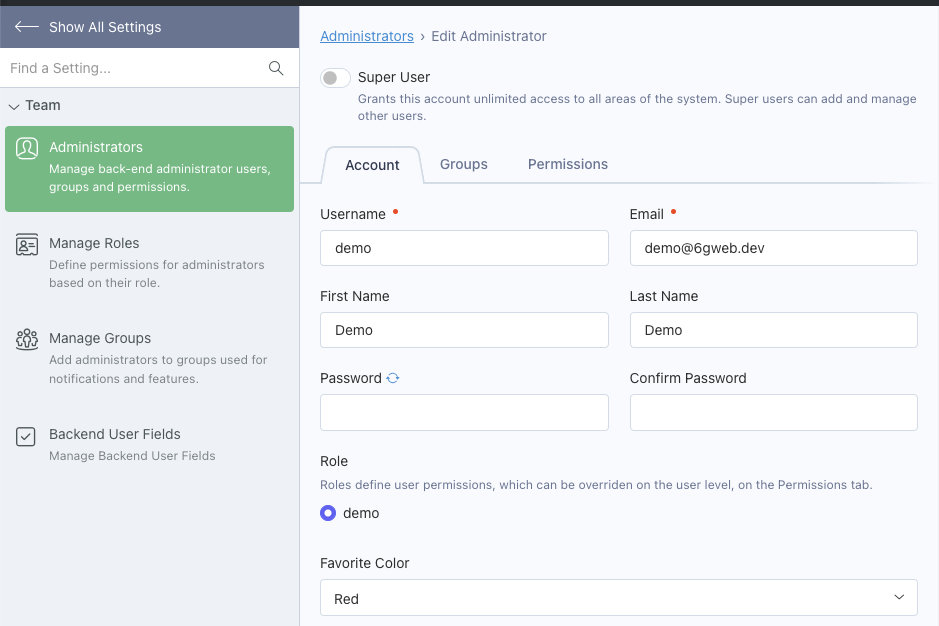

# Backend User Attributize Integration

Integrates Attributize with the Backend User. 

Adds a new **Backend User Fields** settings item, under the Team category.

Refer to the [Field List](/attributize/usage/list) and [Field Editor](/attributize/usage/editor) pages for more information on field management
