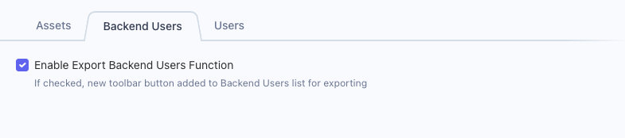
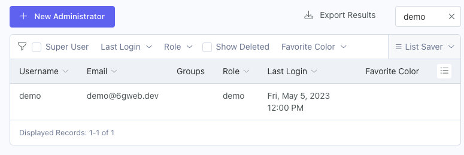

# Settings

## Enable Export Backend Users Function
Check this box to add the **Export Results** button to the Backend User's list.  This button will export the results you have configured for your list columns and filters, without pagination.

Export Results button added

