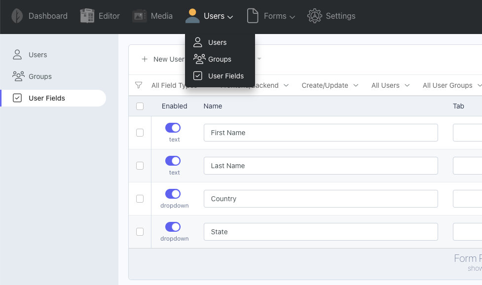

# AttributizeUsers

Integrates Attributize with the RainLab User plugin. Adds a new **User Fields** backend menu item and injects the Attributize Field component into the RainLab.User Account component.

Refer to the [Field List](/attributize/usage/list) and [Field Editor](/attributize/usage/editor) pages for more information on field management

