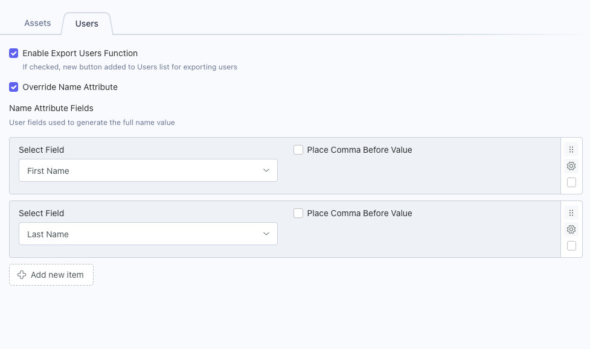
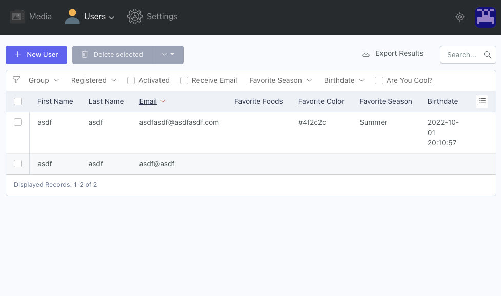

# Settings

## Enable Export Users Function
Check this box to add the **Export Results** button to the User's list.  This button will export the results you have configured for your list columns and filters, without pagination.

## Override Name Attribute

The fields will combine to form the user's full name and allow you to place a comma before a value.  For example **first_name last_name, designation**  If the user has no designation, the comma will not be inserted.

### RainLab.User Version 2.x

Check this box to define the custom fields that will store the default **name** column value.

When enabled the **name** and **surname** fields/columns will be removed from the user list and editor.

### RainLab.User Version 3.x

Check this box to define the custom fields that will store the default **first_name** column value.

When enabled, the **first_name** and **last_name** fields/columns will be removed from the user list and editor.

:::warning Workaround Note
User v3 introduced the [user registration component](https://octobercms.com/plugin/docs/rainlab-user/component-registration), which contains [hardcoded first_name and last_name validation rules](https://github.com/rainlab/user-plugin/blob/5e1dfaf0d0ac5e3e9061bcaabfe090eed5f7be9b/components/Registration.php#L105).  When **Override Name Attribute** is enabled, AttributizeUsers sets the first_name and last_name values to the email address, in order to pass validation.  Before the new User is saved, the last_name value is cleared and the first_name value will update to your selected fields.
:::