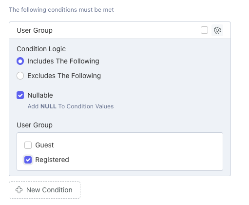

# Editor
The conditions field will be added to form widgets that edit a Conditionable model, via integrations.  The conditions field is an [OctoberCMS repeater field](https://docs.octobercms.com/3.x/element/form/widget-repeater.html) that displays available Conditioners.

Below, the [RainLab.User integration](/conditionsusers/) enables the User Group Conditioner.

**Condition Logic**: Logic used when checking conditions.  Either includes the checked values (Inclusive) or excludes the checked values (Exclusive).

**Nullable**: When checked, conditions will also check for null conditioner value.  For example, a visitor that is not logged in would be NULL for the User or User Group conditioners.

**Values**: Integration defined form field to select one or more conditioners by ID