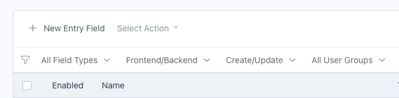

# Filter
List widgets displaying a Conditionable model will have new filter dropdowns added, based on the installed integrations.

The following example shows the Conditions integration with RainLab.User, which adds the User Group filter to the list widget.

