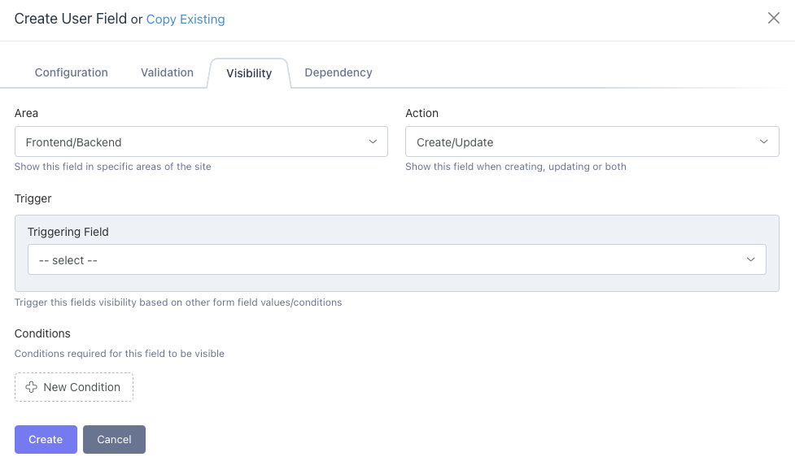

# Attributize Conditions Integration

Integrates Conditions with Sixgweb Attributize plugin. Adds Conditions repeater to [Visibility](/attributize/usage/editor/tabs/visibility) tab.  Refer to the [Conditions Editor](/conditions/usage/editor.html) for more information on Conditions.

