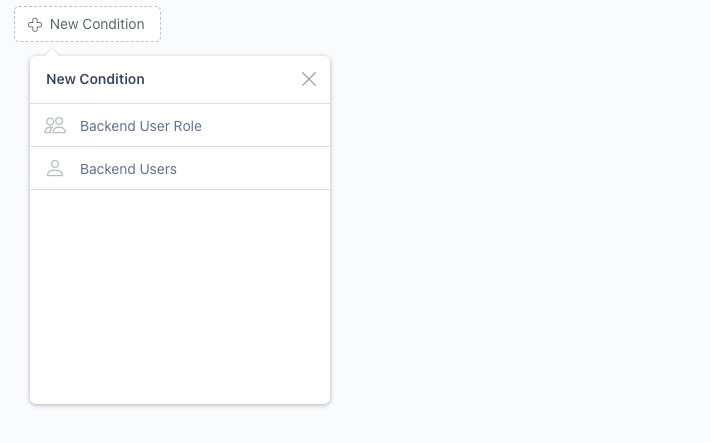
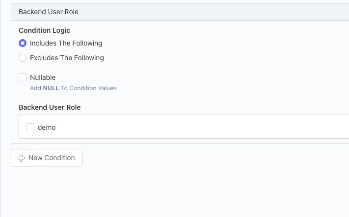
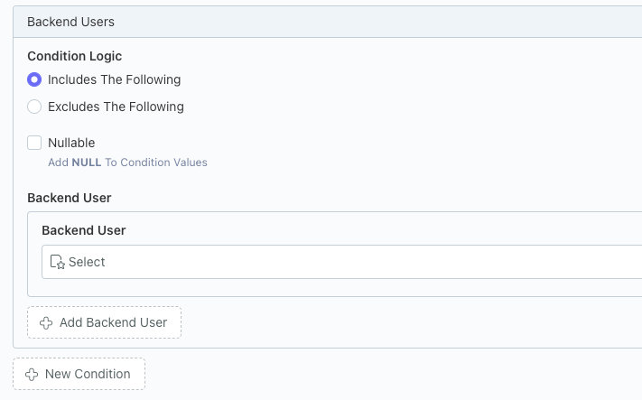

# Backend User Conditions Integration

Integrates Conditions with Backend Users. Adds new Backend User and Backend User Role conditioners to the Conditions editor.  Refer to the [Conditions Editor](/conditions/usage/editor.html) for more information on Conditions.

## Adding Backend User or Backend User Role Condition

Press the **New Condition** button to open the condition type selector and select the type of conditioner you want.

::: warning NOTE
Condition types can only be added once.  Attempting to add the condition type multiple times, will throw a warning
:::

## Backend Role Conditions

### Condition Logic
The logic used when matching conditions.  **Includes** will match the checked user roles.  **Exclude** will match the unchecked user roles.

### Nullable
Include users without a user role in the condition logic.

### Backend User Role
The user roles to check against the condition logic.

## Backend User Conditions

### Condition Logic
The logic used when matching conditions.  **Includes** will match users added to the user repeater.  **Exclude** will match users <ins>not</ins> added to the user repeater.

### Nullable
Include visitors (not logged in) in the condition logic.

Using Exclude logic with this checked would exclude visitors.  Using Include logic with this checked will include visitors.

### User
The users to check against the condition logic.  Press the **Add User** button to add multiple users.
