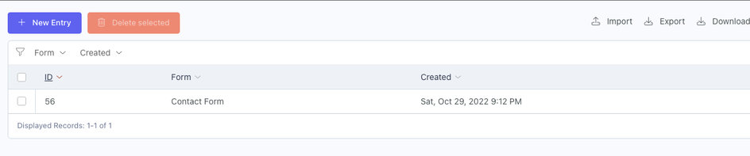
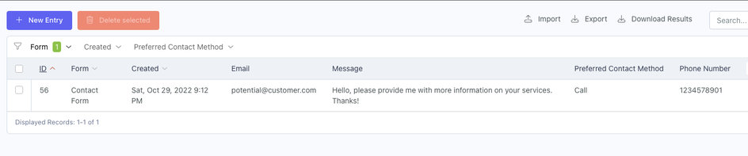
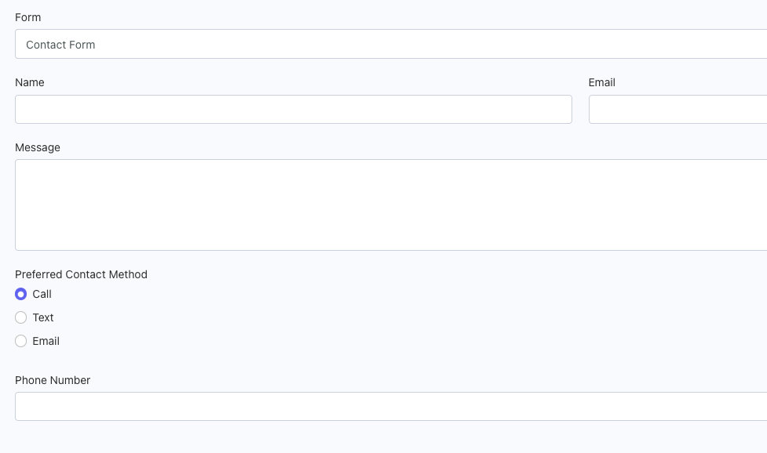

# Entries Controller

The Entries Controller displays all the form submissions for your website, filterable by Form and/or Creation Date.

Once a form is selected in the Form filter, you will have the corresponding fields available in the List Setup and any fields with the setting **Is Filterable** added to the filter widget.

::: tip ListSaver Plugin
Check out the [ListSaver](https://octobercms.com/plugin/sixgweb-listsaver) plugin to save your filter/list column setup for quick switching between entries.
:::

## Entry Editor

Fields without form conditions will alway be visible.  Fields with form conditions will appear/hide based on the selected form value.

