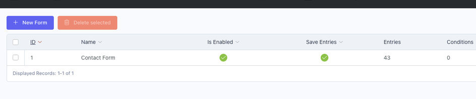
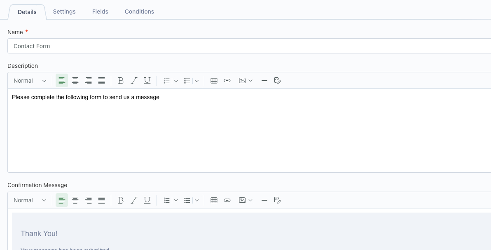
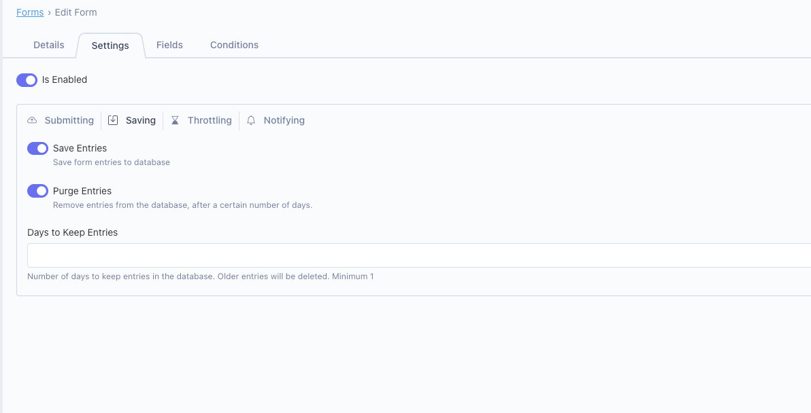
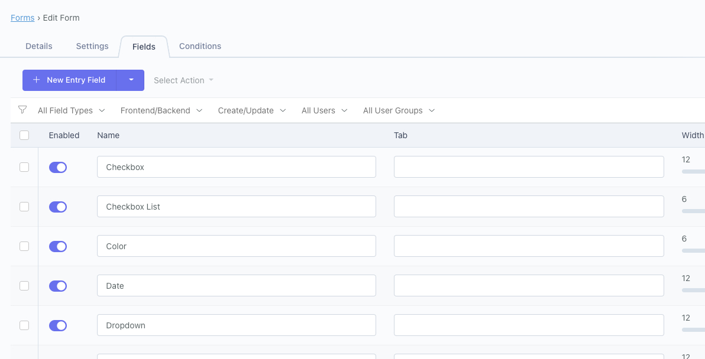

# Forms Controller
The forms area contains all of the forms for your project and provides the following configuration:

## Details Tab

| Field | Description |
| --- | -- |
| Name | The name of the form |
| Description | The description of the form, shown above the form fields |
| Confirmation Message | The message displayed to the user upon successful entry.  Message does not display if form set to redirect after submission |

## Settings Tab

| Field | Description |
| ----------- | ----------- |
| Is Enabled | Enable or disable the form |
| Submission Redirect URL | Absolute/Relative URL to redirect to, after form submission.  Leave blank to show form Confirmation Message. |
| Save Entries | Save entries to the database |
| Purge Entries | Purge entries saved to the database, after a specified number of days |
| Days to Keep Entries | Number of days to keep entries, if Purge Entries is enabled |
| Throttle Entries | Whether visitors should have to wait before submitting the form again |
| Throttle Timeout | Number of seconds the visitor must wait, if throttling is enabled |

## Fields Tab

The Attributize fields editor is available, after the form has been created.

Displays the Attributize field editor.

::: tip Automatic Conditions
Fields created under the Fields Tab will automatically have a condition created for the current form.
:::

## Conditions Tab
Displays the form Conditions editor, allowing conditions required to view the form.