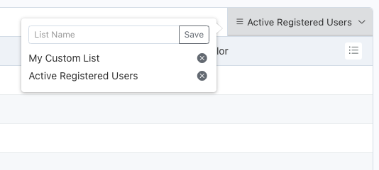

# ListSaver Plugin

 Save the current list setup and filter values for all [ListControllers](https://docs.octobercms.com/3.x/extend/lists/list-controller.html).  Interface is provided via a custom filter widget and is automatically added to all ListControllers.

