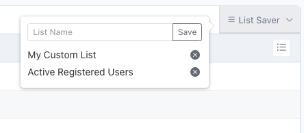

# Usage

#### Save Current List/Filters
1. Set up your list columns and order, by clicking the List Setup found at the end of the list header columns 
2. Set the the values for any available filters
3. Press the ListSaver button, name your list and press Save 

#### Load List/Filters
Click the list saver button and select from your currently saved lists.